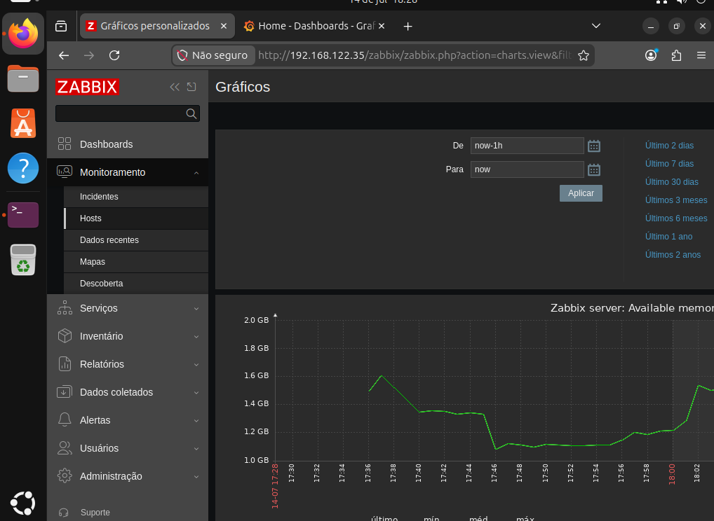
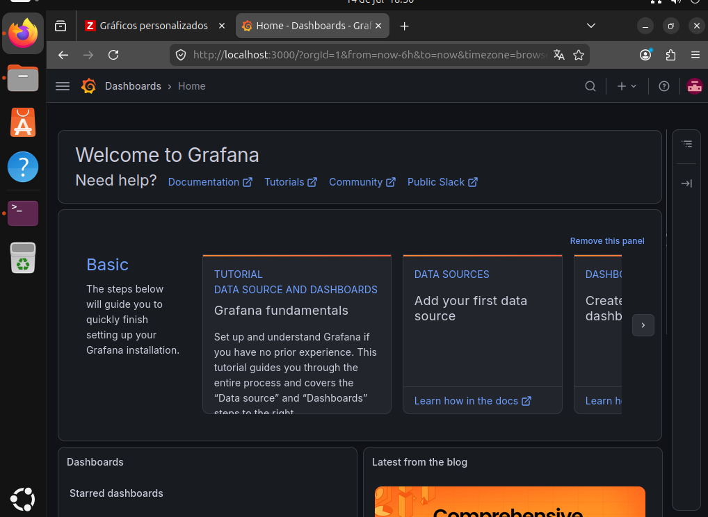
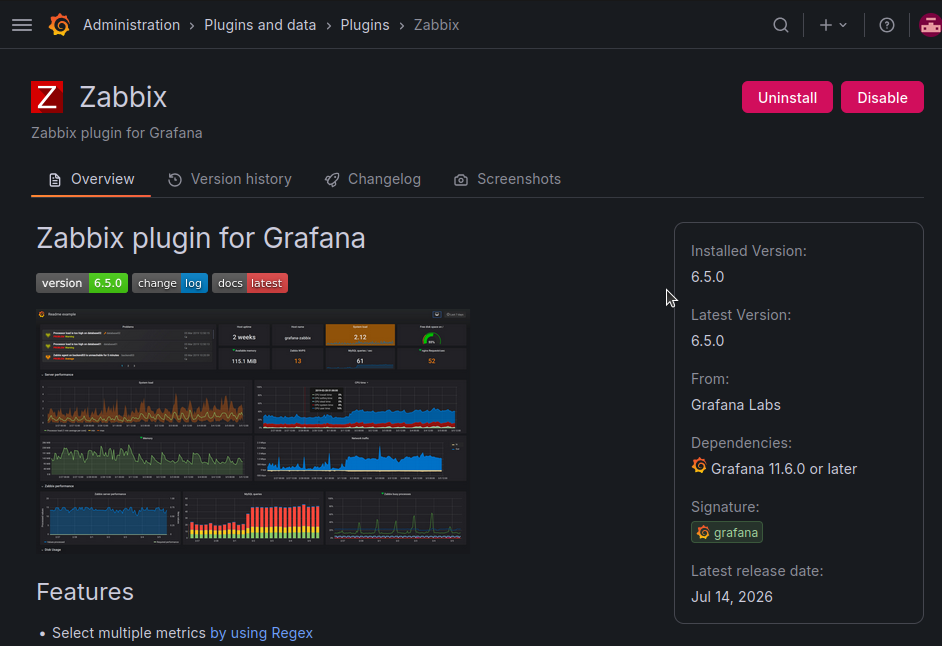
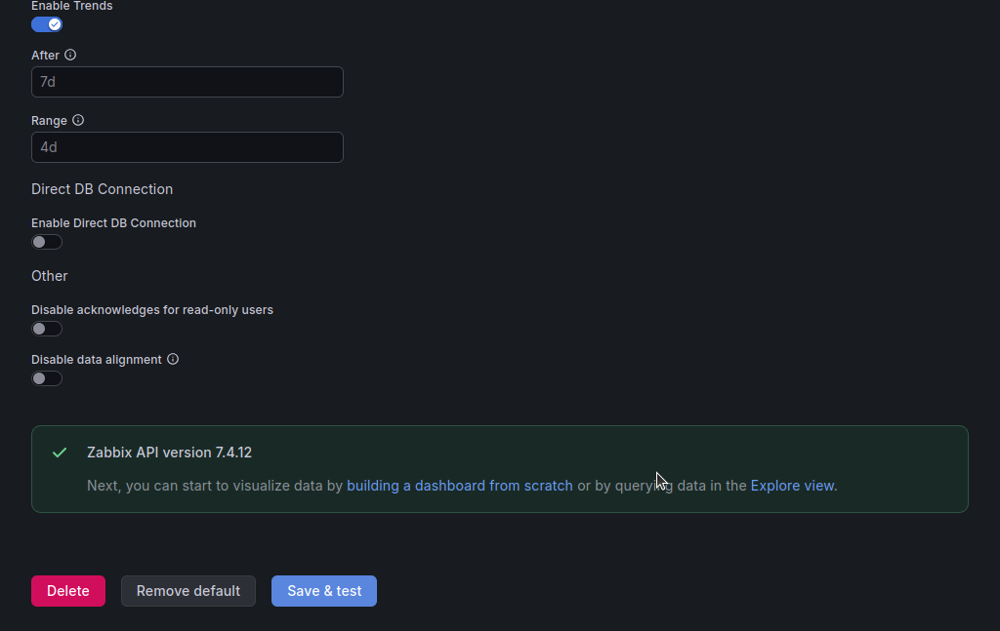
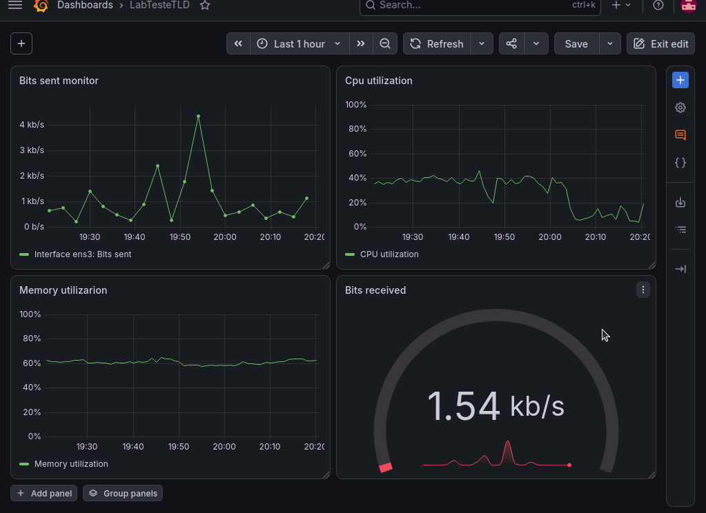

# Lab de Monitoramento NOC/INFRA — Zabbix + Grafana

Este projeto demonstra a implementação de um ambiente de monitoramento de infraestrutura utilizando o **Zabbix** (coleta de métricas) integrado ao **Grafana** (visualização), rodando na mesma VM Ubuntu.

## Arquitetura do Ambiente

O laboratório foi construído usando:

- **Servidor:** Ubuntu Server com Zabbix Server + Frontend (Apache/PHP) instalados via documentação oficial.
- **Coleta:** Zabbix Agent instalado na própria máquina, monitorando a si mesma.
- **Visualização:** Grafana OSS + plugin `alexanderzobnin-zabbix-app`, consumindo os dados via API do Zabbix.

---

## Etapas de Implementação

### 1. Instalação do Zabbix Server

Instalei o Zabbix Server, frontend e banco de dados(MYSQL) seguindo a documentação oficial do Zabbix

### 2. Instalação do Zabbix Agent (auto-monitoramento)

Para o servidor monitorar a si mesmo, instalei o agente local:

```
sudo apt-get update
sudo apt-get install zabbix-agent -y
```

Não precisei editar o arquivo de configuração (`/etc/zabbix/zabbix_agentd.conf`) manualmente os valores padrão já apontavam corretamente pra o ip, já que o agente está monitorando a própria máquina onde o Zabbix Server roda.

Reiniciei e habilitei o serviço:

```
sudo systemctl restart zabbix-agent
sudo systemctl enable zabbix-agent
```
E após seguir os passos de instalação tive sucesso ao logar no dashboard do Zabbix 



### 3. Instalação do Grafana OSS

Instalei as dependências e adicionei o repositório oficial:

```
sudo apt-get install -y apt-transport-https wget gnupg
sudo mkdir -p /etc/apt/keyrings

sudo wget -O /etc/apt/keyrings/grafana.asc https://apt.grafana.com/gpg-full.key
sudo chmod 644 /etc/apt/keyrings/grafana.asc

echo "deb [signed-by=/etc/apt/keyrings/grafana.asc] https://apt.grafana.com stable main" | sudo tee -a /etc/apt/sources.list.d/grafana.list
```

Atualizei a lista de pacotes e instalei a versão OSS:

```
sudo apt-get update
sudo apt-get install grafana
```

Subi o serviço e deixei habilitado no boot:

```
sudo systemctl start grafana-server
sudo systemctl enable grafana-server
```

Acessei em `http://localhost:3000` com o login padrão.



### 4. Instalação do plugin do Zabbix no Grafana

```
sudo grafana-cli plugins install alexanderzobnin-zabbix-app
sudo systemctl restart grafana-server
```

Habilitei o plugin em **Administration > Plugins and data > Plugins**, procurando por **Zabbix** e clicando em **Enable**.





### 5. Integração via Data Source

Configurei o datasource em **Connections > Data sources > Add new data source > Zabbix**:

- **URL:** `http://localhost/zabbix/api_jsonrpc.php`
- **Username:** `Admin`
- **Password:** senha do Zabbix

E após isso tive a validação da API



### 6. Criação do Dashboard

Montei os painéis em **Dashboards > New > New dashboard > Add visualization**, usando o datasource Zabbix:



---

## Conclusão

Este laboratório demonstrou na prática a integração entre uma ferramenta de coleta de métricas (Zabbix) e uma ferramenta de visualização (Grafana). O processo reforçou conceitos de administração de sistemas Linux e observabilidade de infraestrutura.
